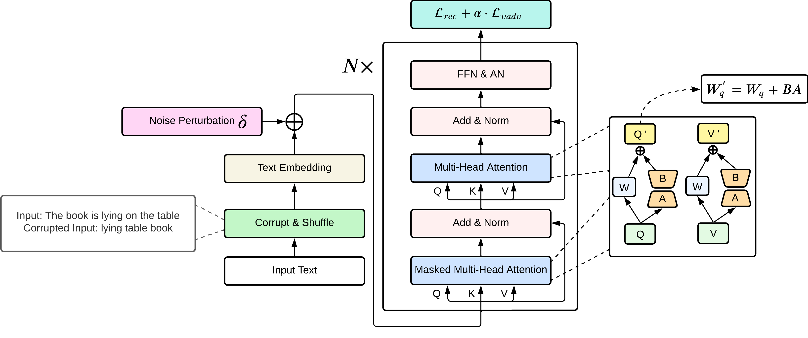

# LAMPAT: Low-rank Adaptation Multilingual Paraphrasing using Adversarial Training

> Paraphrases are texts that convey the same meaning while using different words or sentence structures. It can be used as an automatic data augmentation tool for many Natural Language Processing tasks, especially when dealing with low-resource languages, where data shortage is a significant problem. To generate a paraphrase in multilingual settings, previous studies have leveraged the knowledge from the machine translation field, i.e., forming a paraphrase through zero-shot machine translation in the same language. Despite good performance on human evaluation, those methods still require parallel translation datasets, thus making them inapplicable to languages that do not have parallel corpora. To mitigate that problem, we proposed the first unsupervised multilingual paraphrasing model, LAMPAT (Low-rank Adaptation for Multilingual Paraphrasing using Adversarial Training), by which monolingual dataset is sufficient enough to generate a human-like and diverse sentence. Throughout the experiments, we found out that our method not only works well for English but can generalize on unseen languages as well.

Details of the model architecture and experimental results can be found in [our following paper](https://arxiv.org/abs/2401.04348).

Please CITE our paper whenever this repository is used to help produce published results or incorporated into other software.

    @misc{LAMPAT,
        title = {{LAMPAT: Low-Rank Adaption for Multilingual Paraphrasing Using Adversarial Training}},
        url = {https://arxiv.org/abs/2401.04348},
        author = {Le, Khoi M. and Pham, Trinh and Quan, Tho and Luu, Anh Tuan},
        month = jan,
        year = {2024},
    }

## Run
1. Create conda virtual environment: `conda create -n lampat python=3.8`, activate it: `conda activate lampat`, and install the required packages: `pip install -r requirements.txt`.

2. Download [wmt19_v18](https://data.statmt.org/news-commentary/v18/)

3. Extract the files to `.txt` files, rename all of the files with their [ISO 639-1](https://en.wikipedia.org/wiki/List_of_ISO_639-1_codes) code, and place them in the path `data/wmt19_v18`. For example: `data/wmt19_v18/en.txt`

4. Read and run `train.sh` to train the **LAMPAT** model.

## Evaluation

### Evaluation dataset

The evaluation dataset can be downloaded at [this link](https://hcmuteduvn-my.sharepoint.com/:f:/g/personal/khoi_le_pi2001_hcmut_edu_vn/EoMfM-T_NNJDmGlv8qBKS4oBINUMdaMF9mDncpNsmtNezw?e=uX4Ab6)

Download the zip file and unzip it to put into the `evaluation/eval_dataset`

### Run

In the `evaluation` folder, there are 3 python files:

- `mev_sup_multi_ref.py`: used to evaluate on STAPLE multi-reference evaluation dataset
- `mev_sup.py`: used to evaluate on PAWS-X and Opusparcus
- `mev_unsup.py`: used to evaluate on WMT19

Each file will run the metrics and report the score to the console.
